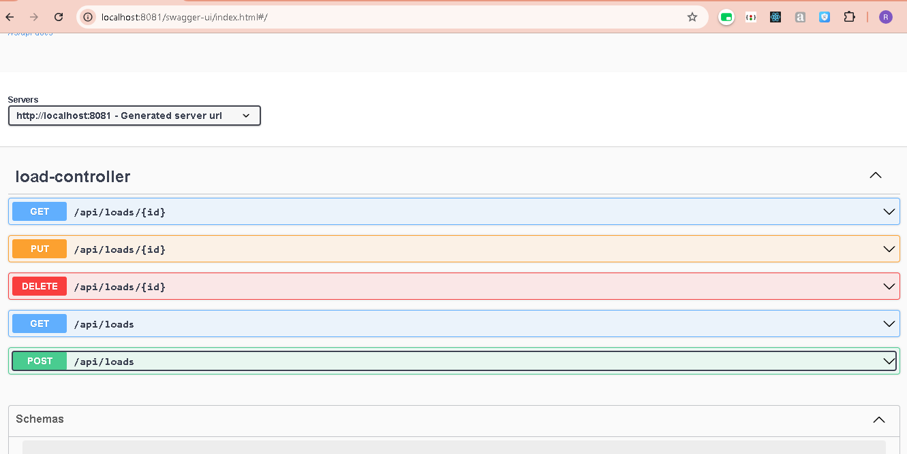
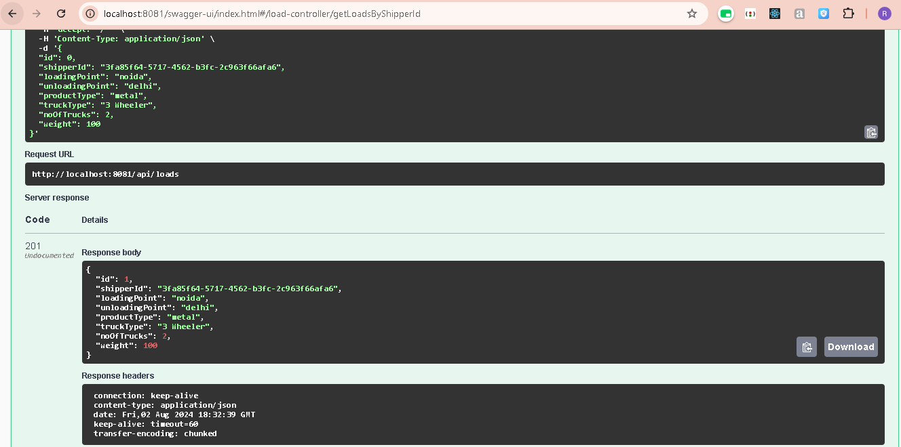

# Loads API 🚚
================

 **Manage Loads Efficiently** 🚀

This is a RESTful API built with Spring Boot to manage loads for shippers. The API provides endpoints for creating, retrieving, updating, and deleting loads.


## Features 🔧
------------

✨ **Create Load**: Create a new load with details such as loading point, unloading point, product type, truck type, and number of trucks.

✨ **Get Loads**: Retrieve a list of loads for a specific shipper ID.

✨ **Get Load by ID**: Retrieve a load by its ID.

✨ **Update Load**: Update an existing load with new details.

✨ **Delete Load**: Delete a load by its ID.

## Technology Stack 🤖
--------------------

* **Spring Boot**: For building the RESTful API
* **PostgreSQL**: For storing load data
* **Java**: For writing the API code

## Getting Started 📌
-------------------
``` git
Clone App: git clone https://github.com/rtanwar572/LiveEasyTest.git liveTest

Go To Location: cd liveTest

"Run The Springboot App"

```

### Prerequisites ✅

* Java 11 or higher
* PostgreSQL 12 or higher
* Spring Boot 2.3.1 or higher
* Maven or Gradle for building the project

### Running the API ✈️

1. Clone the repository: `git clone https://github.com/rtanwar572/LiveEasyTest.git
2. Build the project: `mvn clean package` (if using Maven) or `gradle build` (if using Gradle)
3. Run the API: `java -jar target/loads-api-0.0.1-SNAPSHOT.jar` (if using Maven) or `java -jar build/libs/loads-api-0.0.1-SNAPSHOT.jar` (if using Gradle)

### Starting the API ⚡

To start the API, simply run the following command:
This will start the API on port 8081. You can access the API endpoints using a tool like Postman or Swagger.
```
You Can Run Endpoints On Swagger That Is Accessible There
 on http://localhost:8081/swagger-ui.html
```

### API Endpoints ᯓ★

* `POST /api/loads`: Create a new load
* `GET /api/loads?shipperId={shipperId}`: Retrieve loads for a specific shipper ID
* `GET /api/loads/{id}`: Retrieve a load by its ID
* `PUT /api/loads/{id}`: Update an existing load
* `DELETE /api/loads/{id}`: Delete a load by its ID



### API Results ᯓ★



### Environment Variables 🔐

The API uses the following environment variables:

* `DATABASE_URL`: The URL of the PostgreSQL database
* `DATABASE_USERNAME`: The username for the PostgreSQL database
* `DATABASE_PASSWORD`: The password for the PostgreSQL database

You can set these environment variables using a `.env` file or by setting them as system properties.

### Testing the API 💡

To test the API, you can use a tool like Postman or cURL to send requests to the API endpoints.
You can also use the built-in testing framework in Spring Boot to write unit tests and integration tests for the API.

### Contributing 🤝
---------------

Contributions are welcome! If you'd like to contribute to this project, please fork the repository and submit a pull request.

### License 📝
---------

This project is licensed under the MIT License. See LICENSE for details.

### Author 👤
---------

Rohit Tanwar

### Contact 📩
---------

If you have any questions or need help with the API, please don't hesitate to contact me at (mailto:rtanwar7303@gmail.com).